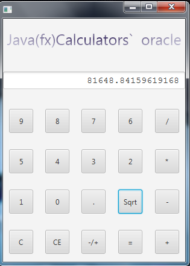

# Калькулятор_021

## В данной статье мы рассмотрим процесс создания простой программы,
### которая состоит из 20 кнопok , и дисплея калькулятора .
## Таблицей стилей по умолчанию для приложений JavaFX является caspian.css,
## которая находится в файле JAR для среды JavaFX, jfxrt.jar.
## В этой таблице стилей определяются стили для корневого узла
## и элементов управления пользовательского интерфейса.
## Чтобы просмотреть этот файл, перейдите в каталог \jre\lib 
## в каталоге, где установлен Java Development Kit (JDK).
## Используйте следующую команду для извлечения таблицы стилей из файла JAR:
### jar xf jfxrt.jar com/sun/javafx/scene/control/skin/caspian/caspian.css

✦1) При нажатии цифры текущая цифра добавляется на дисплей .

✦2) При нажатии кнопки С удаляется последняя цифра .

✦3) При нажатии кнопки CE удаляются все цифры c дисплея .

✦4) При нажатии на операцию введённое число сбрасывается .

✦5) При нажатии на кнопку "-/+" значение меняется на положительное или отрицательное .

✦6) При нажатии на кнопку "Sqrt" выполняется соответствующая скрипту функция ,выведения из текущего числа квадратного корня
             (можно нажимать неограниченное число раз ,функция продолжает дальше выполняться) .
             
✦7) При нажатии на кнопку "=" выполняется действие и результат выводится на дисплей   .			 

✦8) При желании , можно зафоловить мой аккаунт в https://twitter.com/rodomod .

✦9) При желании , можно заблокировать мой аккаунт в https://twitter.com/rodomod .

✦10) Десятичная точка "." , как Вы знаете разделяет целую и дробные части числа .
